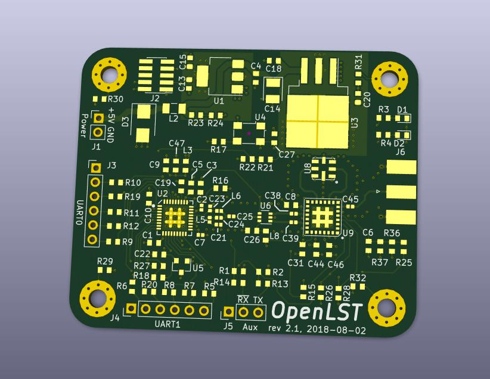

# OpenLST Development/BPP Board

OpenLST board for SEDS@UMD modified by Nathan Kerns. The latest version of Kicad 6 Nightlies is required to view or modify the design. Recent pdf exports of the PCB and schematic are available in the pdf folder, but may not be completely up to date.

TODO:
* Update PCB

## BOM

BOM is automatically generated in KiCAD using "bom_csv_grouped_by_value" script, and manually separated into formats seen in bom folder. `openlst-bom.csv` contains entire BOM, `openlst-bom-digikey.csv` contains Digikey components, and `openlst-bom-mouser.csv` contains Mouser components.

## Power Budgets

3.3 V - 85 mA

* CC1110 - 50 mA max
* ASFL1-27MHz - 15 mA max
* TLV803S - 15 mA max
* PE4259 - <1 mA
* RFFM6404 - <1 mA

4.2 V - 600 mA

* RFFM6404 - 600 mA max

## Frequency Range

430-445 MHz

* CC1110 - 391-464 MHz
* SF2446E - 425-445 MHz
* RFFM6404 - 430-450 MHz

## Temperature Range

Constraining component is ASFL1-27MHz at -20 to 70 C

## PCB

Layers
* F.Cu - GND plane + signals
* In1.Cu - GND plane
* In2.Cu - Power planes
* B.Cu - GND plane + signals

50 ohm traces
* 6 mil (0.15 mm) clearance
* 13.4 mil (0.34 mm) width
* Via fence on 50x50 mil (1.27x1.27 mm) grid

Other traces
* 0.2 mm (8 mil) signal traces
* 0.3 mm (12 mil) power traces
* Power planes for high current paths

# Original readme

OpenLST Reference Hardware
==========================

This repository contains a KiCad project with a hardware reference
implementation for the OpenLST.  This design is a simplified version
of the Texas Instruments CC1110 432 MHz reference design.  A 1 watt
power amplifier module has been added to increase operating range.
The design is intended for use at 437 MHz, however, it may be modified
for use at other frequencies.

The user is responsible for obtaining and maintaining the necessary
license to operate this radio.  The example project uses frequencies
in the US Amateur Radio UHF band. Transmissions in this band require a
valid FCC license and compliance with CFR Part 97.

Contents
--------

This repository contains the following items:

  * [KiCAD 4.0](http://kicad-pcb.org/) project with self-contained part library
  * [Schematic](pdf/openlst-hw.pdf) in PDF form
  * [Bill of materials](bom/) with ordering information for components
  * [Gerber files](gerber/) for PCB fabrication

License & Legal Information
---------------------------

Copyright 2018 Planet Labs Inc. This work is licensed under a
Creative Commons Attribution-ShareAlike 4.0 International License.

This document may contain technology or software the export of which
is or may be restricted by the Export Administration Act and the
Export Administration Regulations (EAR), 15 C.F.R. parts
730-774. Diversion contrary to U.S. law is prohibited.
